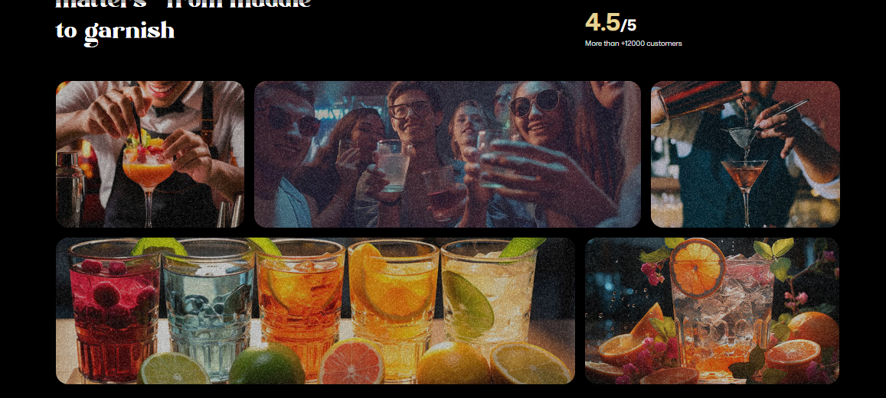

# 🍸 Cocktail Bar Animated Landing Page



Modern animated landing page built with **React**, **Tailwind CSS**, and **GSAP**.

The project focuses on immersive storytelling, cinematic motion, and smooth user experience.  
Designed as a highly visual marketing website with rich scroll interactions and reusable UI blocks.

---

## 🚀 Tech Stack

- React 19
- Vite
- JavaScript
- Tailwind CSS
- GSAP
- @gsap/react
- react-responsive

---

## ✨ Key Features

- Scroll-driven animations
- Cinematic hero transitions
- Parallax effects
- Interactive menus
- Cocktail & recipe showcases
- Fully responsive layout
- Component-based architecture

---

## 🎬 Animation Highlights

- GSAP timelines for precise sequence control
- Element reveal on scroll
- Layered parallax compositions
- Smooth section transitions
- Micro-interactions for UI elements

---

## 🧱 Project Structure Philosophy

The application is split into reusable visual sections.  
Each block can be easily rearranged, replaced, or extended without breaking animation flow.

This makes the landing page adaptable for future content or branding updates.

---

## 🧠 Challenges & Solutions

### Complex animation coordination

Used GSAP timelines and refs to synchronize multiple animated elements and maintain performance.

### Responsiveness

Implemented adaptive layouts and conditional animation triggers for different screen sizes.

### Maintainability

Separated animation logic from UI markup to keep components readable.

---

## ⚙️ Getting Started

### 1. Clone repository

```bash
git clone <repo-url>
cd gsap_project

2. Install dependencies
npm install

▶ Run development server
npm run dev
```
